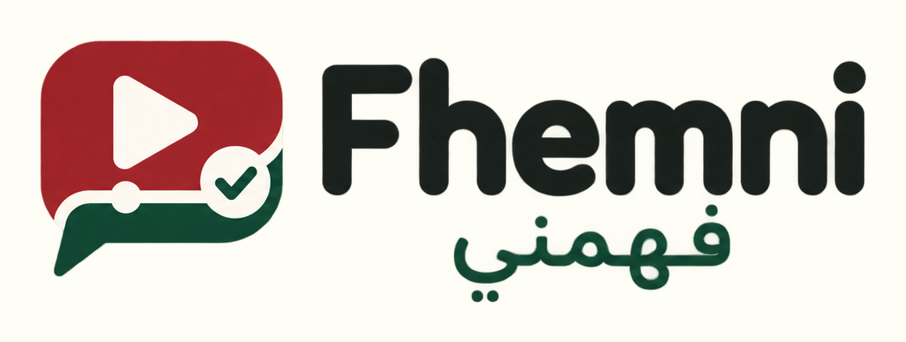

<p align="center">
  
</p>

# Fhemni — فهّمني

Fhemni turns long public YouTube videos into concise, evidence-aware briefings.
It began with Moroccan public-affairs programs that are difficult to follow
episode by episode.

## Highlights

- Moroccan Darija, French, and English
- public catalogue and stable episode pages
- timestamped summaries, chapters, participants, and claims
- party sheets with members and statements
- source-grounded claim checking
- community suggestions and voting
- review-before-publication workflow
- optional authenticated video Q&A with weekly usage limits

## Run locally

Requirements: Java 26. Maven is included.

```bash
./run-local.sh
```

Open [http://localhost:8080](http://localhost:8080). Without a Gemini key, the
interface runs in demo mode and makes no AI calls.

To enable live analysis, copy the example configuration and add your own key:

```bash
cp .env.example .env
```

```text
GEMINI_API_KEY=your-key
```

Never commit `.env`, OAuth credentials, database files, or provider keys. The
test suite uses local stubs and does not consume Gemini quota.

## How the AI integration works

Fhemni uses two complementary integrations:

| Responsibility | Integration |
| --- | --- |
| Agentic video analysis and video-context questions | Google Gen AI Java SDK and Gemini Interactions API |
| Independent, search-grounded fact checking | Spring AI `ChatClient` with Google GenAI |

The split keeps agentic video understanding separate from the independent
evidence pass. The full flow and persistence boundaries are documented in
[Architecture](docs/ARCHITECTURE.md).

## Documentation

- [Contributing and development setup](CONTRIBUTING.md)
- [Architecture](docs/ARCHITECTURE.md)
- [Container setup](docs/CONTAINERS.md)
- [Security policy](.github/SECURITY.md)
- [Optional Arabic font setup](src/main/resources/static/assets/fonts/README.md)

## License

Copyright © 2026 Mohammed Aboullaite.

Fhemni is **source-available**, not OSI open source. It is licensed under the
[Elastic License 2.0](LICENSE), including its managed-service and notice
conditions. The name and logo are covered by [TRADEMARKS.md](TRADEMARKS.md).
